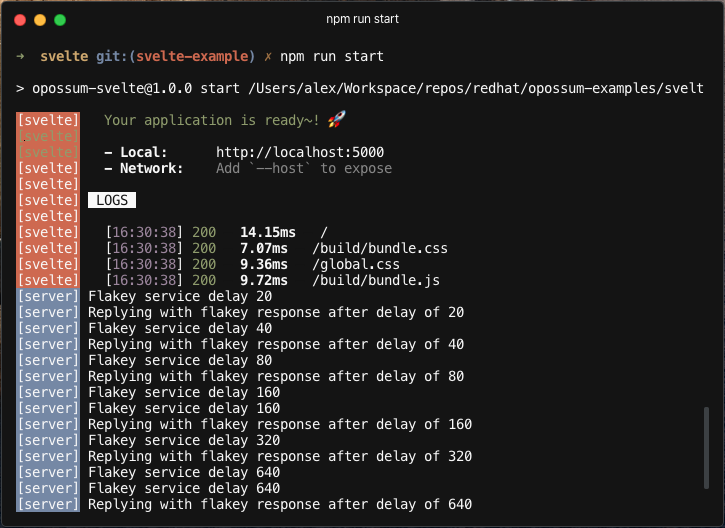
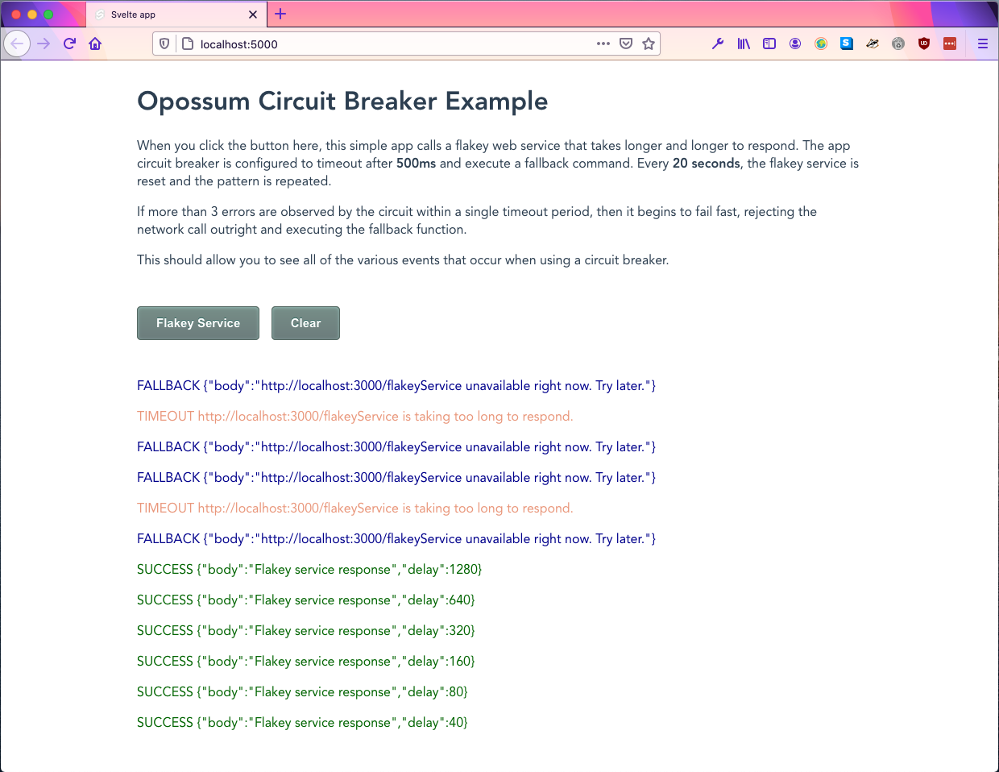

# Svelte Example

This example exposes a simple service at the route `http://localhost:3000/flakeyService`.
For every request the service receives, the response time is increased.
[The service returns a `423 (Locked)` error if the response time is above 1000ms.](https://github.com/nodeshift-starters/opossum-examples/blob/main/vue/server.js#L27) This example also has a web frontend at `http://localhost:5000/` for interacting with the service.

1. Install dependencies

```sh
$ npm install && cd client/ && npm install && cd ..
```

2. Run the example

This example uses the [concurrently](https://www.npmjs.com/package/concurrently) npm module to run the server and the client at the same time.

```sh
$ npm start
```

<h3>Terminal</h3>


<h3>Browser</h3>

